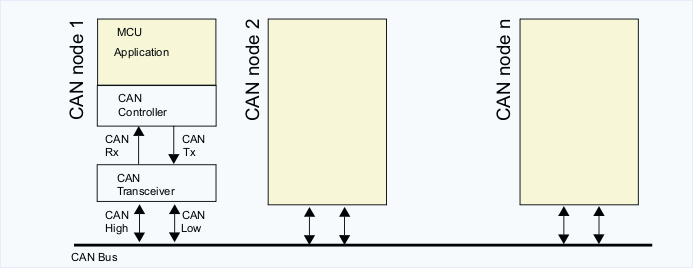

### gtip-thesis
Proof of concept: protocol to scan nodes and instaurate a fault-tolerant communication

#### 1 Intro
We take into account the following scenario, we have a LAN composed of many independent MCUs and each of them collects data that have to send to a master MCU node.

The master node (we call it IHB node) perform different kinds of activities, for example:
- Scanning of all Nodes that are it linked.
- Collecting the data that Nodes are sending to IHB
- Instaurate a communication via CAN interface with a HOST what receives all data that the IHB has collected by nodes that are under it

My goal is to realize a PoC of the IHB that overcomes the limits that are highlighted in the old version of this implementation, the fundamentals:
- Redesign the hardware
- Choose an environment to develop the firmware
- Introduce a fault-tolerant of the IHB node.

#### 2 Hardware:
This project runs on a Nucleo-64 board based on an STM32 microcontroller (MCU). It's mandatory to choose hardware that provides the CAN feature. The CAN feature is composed of two parts, the CAN controller (Nowadays many microcontrollers has embedded one or more CAN controller) and CAN transceiver. If the MCU doesn't provide for the CAN controller (eg the cheap AVR MCU that run on Arduino boars) you need an external chip that provides for CAN controller and transceiver.

- The CAN controller can be 2A (standard frame) and 2B(extend frame) compatible. The most recent and powerful MCUs have a CAN FD controller. 

- In relation to this project, I'm using two [Nucleo-64](https://www.st.com/en/evaluation-tools/nucleo-l476rg.html) powered by stm32l476rg with two external transceivers powered by [MCP2551](https://www.microchip.com/wwwproducts/en/en010405). The transceivers are mounted on a breakout.

- The transceivers need at least 4 cables, first two to supply it, the other to link the CAN TX/RX signal. In relation to the complexity of the transceivers, other links can be required to handle POWER ON/OFF or the SLOPE CONTROL, anyway this depends from specs of your transceiver.

- The breakout board used by MCP2551 has a 4.7KΩ resistor between its RS pin and ground. This force the IC to operate in SLOPE-CONTROL mode, where the slew rate (SR) is proportional to the current ouput at the the RS pin.

- To complete the requirement by the hardware side you need of CAN-USB converter. I suggest you a converter supported by CAN-UTILS to skip all nasty problem due to drivers and other time-consuming stuff

#### 3 Protocol
The protocol implemented by this PoC uses a standard CAN 2A frames for the discovery part while a CAN ISO-TP is used to transfer data from MCU to HOST (the computer that is running the `ihbtool` application)
All single parts of the PoC seems to work well but I have to test all system with a full working CAN-USB converter.

#### 4 Firmware MCU
The directory `fw` contains the firmware that runs on the MCU. It's based on RIOT-OS. The firmware is composed of 2 main modules, the first `IHB-CAN` provides to configure and to set up all the CAN subsystem. The roles (master or idle) handling and data send are its competence. The second `IHB-NETSIM` module simulate a lan of nodes where each node collects data incoming from N tactile sensor. 
The firmware provides another module that is not related to this project, it displays the elapsed time from the last reboot.

#### 5 Host Application
The directory `host/fronted` contains the source code of the `ihbtool` app. It uses the Linux socket can utils.

#### 6 Riot-OS
[Riot-OS](https://doc.riot-os.org/) is the Operative system that I choose to develop this project. It has a small footprint high hardware abstraction and is connectivity oriented. In these last 3 months I gave a contribution to the community with some code pull request and Issue:
- [PR to add SPI transciver to lwip package](https://github.com/RIOT-OS/RIOT/pull/13092) accepted
- [PR to add CAN support for nucleo-l476rg](https://github.com/RIOT-OS/RIOT/pull/13534) accepted
- [PR to add remote request test](https://github.com/RIOT-OS/RIOT/pull/13739) waiting
- [issue about raw can api](https://github.com/RIOT-OS/RIOT/issues/13744) waiting

