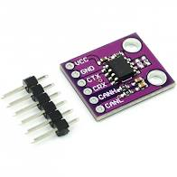

### gtip-thesis
Proof of concept: protocol to scan nodes and instaurate a fault-tolerant communication

#### 1 Intro
We take into account the following scenario, we have a LAN composed of many independent MCUs and each of them collects data that have to send to a master MCU node.

The master node (we call it IHB node) perform different kinds of activities, for example:
- Scanning of all Nodes that are it linked.
- Collecting the data that Nodes are sending to IHB
- Instaurate a communication via CAN interface with a HOST what receives all data that the IHB has collected by nodes that are under it

My goal is to realize a PoC of the IHB that overcomes the limits that are highlighted in the old version of this implementation, the fundamentals:
- Redesign the hardware
- Choose an environment to develop the firmware
- Introduce a fault-tolerant of the IHB node.

#### 2 Tecnique
- This firmware is based on [Riot-OS](https://doc.riot-os.org/).
- The hardare that I'm using are two [Nucleo-64](https://www.st.com/en/evaluation-tools/nucleo-l476rg.html)
powered by stm32l476rg. The nucleo-64 boards need an external transceiver, each
CAN node is composed by two-part, the CAN controller (it's embedded into my Nucleo-64
Board) and an external transceiver. I used a [MCP2551](https://www.microchip.com/wwwproducts/en/en010405)
is easy to find a breakout board like this:

- The breakout board used by MCP2551 uses a 4.7KΩ resistor between its RS pin and
ground. This force the IC to operate in SLOPE-CONTROL mode, where the slew rate
(SR) is proportional to the current ouput at the the RS pin.
Global view of the mcu and transceiver:

- Riot-os for the STM32 family target includes the [perih_can](https://github.com/RIOT-OS/RIOT/blob/master/cpu/stm32_common/periph/can.c)
but it's missing of support for my board (my CPU). I opened a [PR](https://github.com/RIOT-OS/RIOT/pull/13534)
that adds the CAN support to STM32L4 cpu family.
