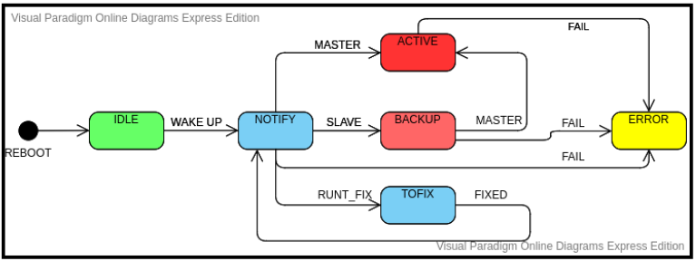

### gtip-thesis
Proof of concept: protocol to scan nodes and instaurate a fault-tolerant communication

#### 1 Intro
We take into account the following scenario, we have a network composed by independent MCUs (Skin nodes) and each of them collects data which have to send to a master MCU node (IHB node)

The master node (IHB node) perform different kinds of activities, for example:
- To scan the network (we call it patch) composed by Skin nodes
- Handle these nodes and download its data.
- Instaurate a communication via CAN interface with the HOST that receives data wich the IHB has collected from the patch

My goal is to realize a PoC of the IHB that overcomes the limits that are highlighted in the old version of this implementation, the fundamentals:
- Redesign the hardware
- Choose an environment to develop the firmware
- Introduce a fault-tolerant of the IHB node.

#### 2 Hardware:
This project runs on a Nucleo-64 board based on an STM32 microcontroller (MCU). It's mandatory to choose hardware that provides for the CAN feature. The CAN feature is composed of two parts, the CAN controller (Nowadays many microcontrollers has embedded one or more CAN controller) and CAN transceiver. If the MCU doesn't provide for the CAN controller (eg the cheap AVR MCU that run on Arduino boars) you need an external chip which provides for CAN controller and transceiver.

- The CAN controller can be 2A (standard frame) and 2B(extend frame) compatible, nowdays many MCUs include a most recent CAN FD controller.

- In relation to this project, I'm using two [Nucleo-64](https://www.st.com/en/evaluation-tools/nucleo-l476rg.html) powered by stm32l476rg with two external transceivers powered by [MCP2551](https://www.microchip.com/wwwproducts/en/en010405). The transceivers are mounted on a breakout.

- The transceivers need at least 4 cables, first two to supply it, other to link the CAN TX/RX signal. In relation to the complexity of the transceivers, other links can be required to handle POWER ON/OFF and or the SLOPE CONTROL, anyway this depends from specs of your transceiver.

- The breakout board used by MCP2551 has a 4.7KΩ resistor between its RS pin and ground. This force the IC to operate in SLOPE-CONTROL mode, where the slew rate (SR) is proportional to the current ouput at the the RS pin.

- To complete the requirement by hardware side you need of CAN-USB converter. I suggest you a converter supported by CAN-UTILS to skip all nasty problems due to drivers and other time-consuming stuff

#### 3 Protocol
The protocol implemented by this PoC uses a standard CAN 2A frames for the discovery part while a CAN ISO-TP is used to transfer datas from MCU to HOST (the computer which is running the `ihbtool` application)

#### 4 Firmware MCU
The directory `fw` contains the firmware that runs on the IHB. It's based on RIOT-OS. The firmware is composed of 2 main module:
- The `IHB-CAN` is the main module, it configures the CAN subsystem, handles the finite state machine (fsm) and uses the standard ISO-TP to send data towards host.
There's 6 state (IDLE, NOTIFY, BACKUP, ACTIVE, TOFIX, ERR).

This module is composed by two drivers, first cotrols the finite state machine while the second handles te iso-tp transmission.
- The `IHB-NETSIM` module simulate a patch of Skin nodes where each node collects data incoming from N tactile sensor.

#### 5 Host Application
The directory `host/fronted` contains the source code of the `ihbtool` app. It uses the Linux socket can utils.

#### 6 Riot-OS
[Riot-OS](https://doc.riot-os.org/) is the Operative system that I choose to develop this project. It has a small footprint high hardware abstraction and is connectivity oriented. In these last 3 months I gave a small contribution to the community:
- [PR to add SPI transciver to lwip package](https://github.com/RIOT-OS/RIOT/pull/13092) accepted
- [PR to add CAN support for nucleo-l476rg](https://github.com/RIOT-OS/RIOT/pull/13534) accepted
- [PR to add remote request test](https://github.com/RIOT-OS/RIOT/pull/13739) accepted

